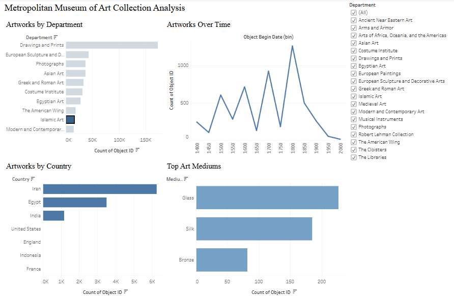
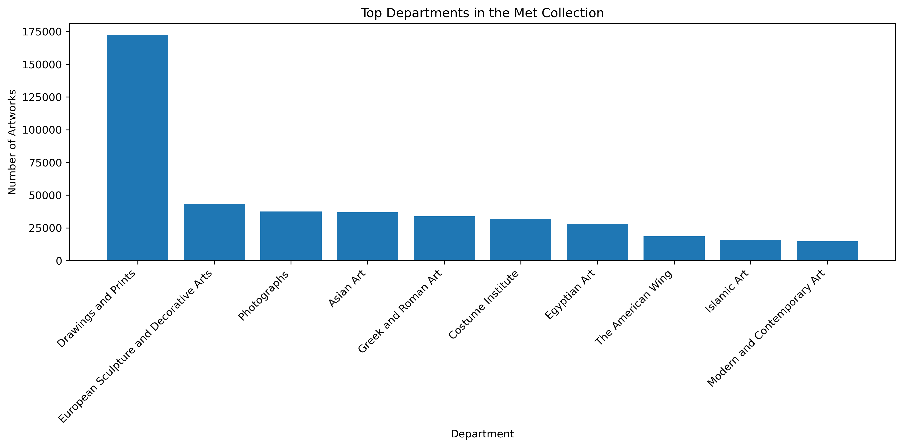
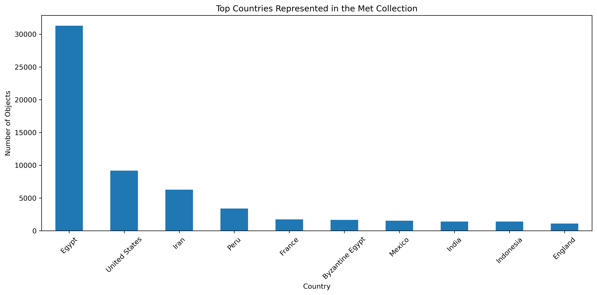
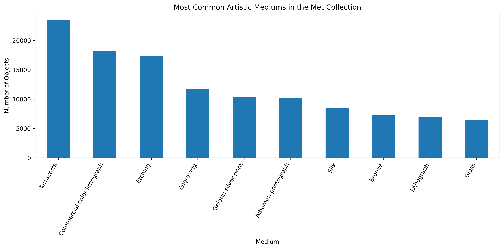
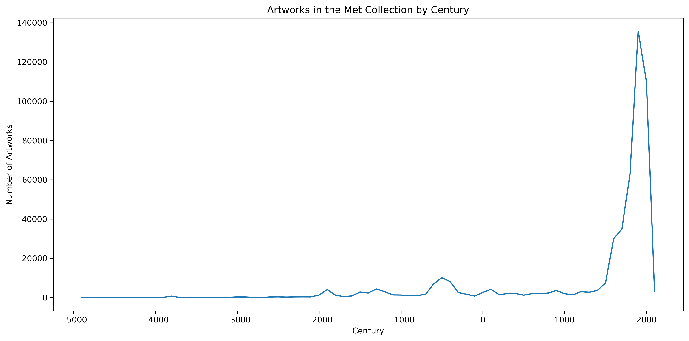
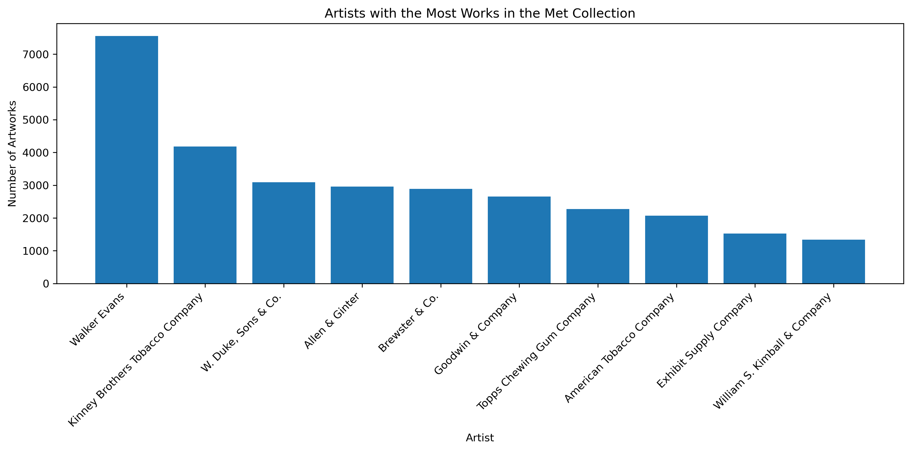

# Metropolitan Museum Collection Data Analysis

This project analyzes the Metropolitan Museum of Art Open Access dataset using Python, Pandas, and Matplotlib.

## Tableau Dashboard

Interactive dashboard exploring patterns in the
Metropolitan Museum of Art collection dataset.

View the dashboard here:
https://public.tableau.com/app/profile/xenel.islam/viz/met_museum_analysis/Dashboard1

## Key Insights

- The Drawings and Prints department contains the largest share of objects in the collection.
- Egypt is the most represented country of origin in the dataset.
- Printmaking techniques such as etching, engraving, and lithography appear frequently.
- Artwork production increases dramatically in the 18th–20th centuries.
- Several artists appear repeatedly in the collection, showing strong representation of major art historical figures.

This analysis uses the **Metropolitan Museum of Art Open Access dataset**, which contains information on over **480,000 artworks** in the museum's collection.

The dataset includes fields such as:

- Department
- Country of origin
- Artistic medium
- Artist display name
- Object begin date

The dataset allows exploration of historical, geographic, and material trends across the museum's holdings.

## Tools Used

- Python
- Pandas
- Matplotlib
- Jupyter Notebook

## Files

- `museum_analysis.ipynb` — full analysis notebook
- `images/` — saved charts from the project

## Dataset

This project uses the Metropolitan Museum of Art Open Access dataset.

## Sample Visuals

